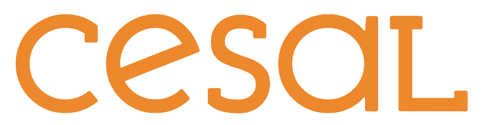
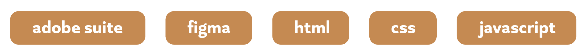

 graphic designer and cartoonist 

[Landing Page](https://github.com/tglass3)

---

# graphic design intern

### Spokane Arts (jul 2022 - sept 2022)
Create promotional graphics that visually compliment artists’ work, follow established brand guides, prepare files for print and social media, meet weekly to report progress, and organize and update logo, social media, and print files for next intern.

# freelance graphic designer

### Self-employed (jun 2021 - current)
Work with client to outline final product requirements and deliverables, set deadlines and checkpoints for progress reports and communicate regularly, impliment client feedback, and explain design decisions when necessary.

# Skills

# Education

## Bachelor of Design
### Eastern Washington University (2022 - 2024)  

## Associate of Applied Science, Graphic Design
### Spokane Falls Community College (2020 - 2022)  

# Awards

<h2 style="margin-bottom: 0px;"> American Advertising Awards, 2022</h2>
<li>Single, Silver</li>
<li>Single, Bronze</li>
<li>Cover/Editorial Spread, Bronze</li>
<li>Logo Design, Bronze</li>

